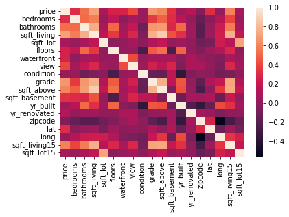
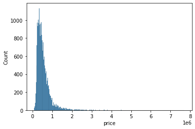
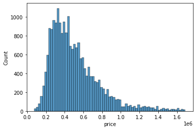
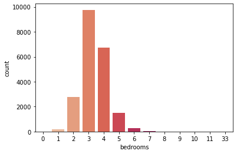
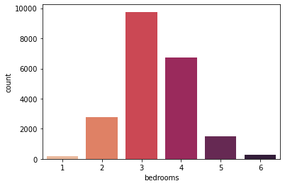
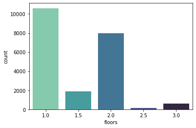

# House-price-prediction<center> <h1>House price prediction</h1> </center>

The data comes from this page: https://www.kaggle.com/datasets/harlfoxem/housesalesprediction

### Import library


```python
import pandas as pd
import numpy as np
import seaborn as sns
import itertools
import matplotlib.pyplot as plt
from sklearn.model_selection import train_test_split
from sklearn.linear_model import LinearRegression
from sklearn.ensemble import RandomForestRegressor
from sklearn.tree import DecisionTreeRegressor
```

### Load data


```python
data = pd.read_csv('kc_house_data.csv')
```

### Data exploration


```python
data.head()
```


<div>
<style scoped>
    .dataframe tbody tr th:only-of-type {
        vertical-align: middle;
    }

    .dataframe tbody tr th {
        vertical-align: top;
    }

    .dataframe thead th {
        text-align: right;
    }
</style>
<table border="1" class="dataframe">
  <thead>
    <tr style="text-align: right;">
      <th></th>
      <th>id</th>
      <th>date</th>
      <th>price</th>
      <th>bedrooms</th>
      <th>bathrooms</th>
      <th>sqft_living</th>
      <th>sqft_lot</th>
      <th>floors</th>
      <th>waterfront</th>
      <th>view</th>
      <th>...</th>
      <th>grade</th>
      <th>sqft_above</th>
      <th>sqft_basement</th>
      <th>yr_built</th>
      <th>yr_renovated</th>
      <th>zipcode</th>
      <th>lat</th>
      <th>long</th>
      <th>sqft_living15</th>
      <th>sqft_lot15</th>
    </tr>
  </thead>
  <tbody>
    <tr>
      <th>0</th>
      <td>7129300520</td>
      <td>20141013T000000</td>
      <td>221900.0</td>
      <td>3</td>
      <td>1.00</td>
      <td>1180</td>
      <td>5650</td>
      <td>1.0</td>
      <td>0</td>
      <td>0</td>
      <td>...</td>
      <td>7</td>
      <td>1180</td>
      <td>0</td>
      <td>1955</td>
      <td>0</td>
      <td>98178</td>
      <td>47.5112</td>
      <td>-122.257</td>
      <td>1340</td>
      <td>5650</td>
    </tr>
    <tr>
      <th>1</th>
      <td>6414100192</td>
      <td>20141209T000000</td>
      <td>538000.0</td>
      <td>3</td>
      <td>2.25</td>
      <td>2570</td>
      <td>7242</td>
      <td>2.0</td>
      <td>0</td>
      <td>0</td>
      <td>...</td>
      <td>7</td>
      <td>2170</td>
      <td>400</td>
      <td>1951</td>
      <td>1991</td>
      <td>98125</td>
      <td>47.7210</td>
      <td>-122.319</td>
      <td>1690</td>
      <td>7639</td>
    </tr>
    <tr>
      <th>2</th>
      <td>5631500400</td>
      <td>20150225T000000</td>
      <td>180000.0</td>
      <td>2</td>
      <td>1.00</td>
      <td>770</td>
      <td>10000</td>
      <td>1.0</td>
      <td>0</td>
      <td>0</td>
      <td>...</td>
      <td>6</td>
      <td>770</td>
      <td>0</td>
      <td>1933</td>
      <td>0</td>
      <td>98028</td>
      <td>47.7379</td>
      <td>-122.233</td>
      <td>2720</td>
      <td>8062</td>
    </tr>
    <tr>
      <th>3</th>
      <td>2487200875</td>
      <td>20141209T000000</td>
      <td>604000.0</td>
      <td>4</td>
      <td>3.00</td>
      <td>1960</td>
      <td>5000</td>
      <td>1.0</td>
      <td>0</td>
      <td>0</td>
      <td>...</td>
      <td>7</td>
      <td>1050</td>
      <td>910</td>
      <td>1965</td>
      <td>0</td>
      <td>98136</td>
      <td>47.5208</td>
      <td>-122.393</td>
      <td>1360</td>
      <td>5000</td>
    </tr>
    <tr>
      <th>4</th>
      <td>1954400510</td>
      <td>20150218T000000</td>
      <td>510000.0</td>
      <td>3</td>
      <td>2.00</td>
      <td>1680</td>
      <td>8080</td>
      <td>1.0</td>
      <td>0</td>
      <td>0</td>
      <td>...</td>
      <td>8</td>
      <td>1680</td>
      <td>0</td>
      <td>1987</td>
      <td>0</td>
      <td>98074</td>
      <td>47.6168</td>
      <td>-122.045</td>
      <td>1800</td>
      <td>7503</td>
    </tr>
  </tbody>
</table>
<p>5 rows × 21 columns</p>
</div>


```python
data.info()
```

    <class 'pandas.core.frame.DataFrame'>
    RangeIndex: 21613 entries, 0 to 21612
    Data columns (total 21 columns):
     #   Column         Non-Null Count  Dtype  
    ---  ------         --------------  -----  
     0   id             21613 non-null  int64  
     1   date           21613 non-null  object 
     2   price          21613 non-null  float64
     3   bedrooms       21613 non-null  int64  
     4   bathrooms      21613 non-null  float64
     5   sqft_living    21613 non-null  int64  
     6   sqft_lot       21613 non-null  int64  
     7   floors         21613 non-null  float64
     8   waterfront     21613 non-null  int64  
     9   view           21613 non-null  int64  
     10  condition      21613 non-null  int64  
     11  grade          21613 non-null  int64  
     12  sqft_above     21613 non-null  int64  
     13  sqft_basement  21613 non-null  int64  
     14  yr_built       21613 non-null  int64  
     15  yr_renovated   21613 non-null  int64  
     16  zipcode        21613 non-null  int64  
     17  lat            21613 non-null  float64
     18  long           21613 non-null  float64
     19  sqft_living15  21613 non-null  int64  
     20  sqft_lot15     21613 non-null  int64  
    dtypes: float64(5), int64(15), object(1)
    memory usage: 3.5+ MB
    


```python
data.describe()
```


<div>
<style scoped>
    .dataframe tbody tr th:only-of-type {
        vertical-align: middle;
    }

    .dataframe tbody tr th {
        vertical-align: top;
    }

    .dataframe thead th {
        text-align: right;
    }
</style>
<table border="1" class="dataframe">
  <thead>
    <tr style="text-align: right;">
      <th></th>
      <th>id</th>
      <th>price</th>
      <th>bedrooms</th>
      <th>bathrooms</th>
      <th>sqft_living</th>
      <th>sqft_lot</th>
      <th>floors</th>
      <th>waterfront</th>
      <th>view</th>
      <th>condition</th>
      <th>grade</th>
      <th>sqft_above</th>
      <th>sqft_basement</th>
      <th>yr_built</th>
      <th>yr_renovated</th>
      <th>zipcode</th>
      <th>lat</th>
      <th>long</th>
      <th>sqft_living15</th>
      <th>sqft_lot15</th>
    </tr>
  </thead>
  <tbody>
    <tr>
      <th>count</th>
      <td>2.161300e+04</td>
      <td>2.161300e+04</td>
      <td>21613.000000</td>
      <td>21613.000000</td>
      <td>21613.000000</td>
      <td>2.161300e+04</td>
      <td>21613.000000</td>
      <td>21613.000000</td>
      <td>21613.000000</td>
      <td>21613.000000</td>
      <td>21613.000000</td>
      <td>21613.000000</td>
      <td>21613.000000</td>
      <td>21613.000000</td>
      <td>21613.000000</td>
      <td>21613.000000</td>
      <td>21613.000000</td>
      <td>21613.000000</td>
      <td>21613.000000</td>
      <td>21613.000000</td>
    </tr>
    <tr>
      <th>mean</th>
      <td>4.580302e+09</td>
      <td>5.400881e+05</td>
      <td>3.370842</td>
      <td>2.114757</td>
      <td>2079.899736</td>
      <td>1.510697e+04</td>
      <td>1.494309</td>
      <td>0.007542</td>
      <td>0.234303</td>
      <td>3.409430</td>
      <td>7.656873</td>
      <td>1788.390691</td>
      <td>291.509045</td>
      <td>1971.005136</td>
      <td>84.402258</td>
      <td>98077.939805</td>
      <td>47.560053</td>
      <td>-122.213896</td>
      <td>1986.552492</td>
      <td>12768.455652</td>
    </tr>
    <tr>
      <th>std</th>
      <td>2.876566e+09</td>
      <td>3.671272e+05</td>
      <td>0.930062</td>
      <td>0.770163</td>
      <td>918.440897</td>
      <td>4.142051e+04</td>
      <td>0.539989</td>
      <td>0.086517</td>
      <td>0.766318</td>
      <td>0.650743</td>
      <td>1.175459</td>
      <td>828.090978</td>
      <td>442.575043</td>
      <td>29.373411</td>
      <td>401.679240</td>
      <td>53.505026</td>
      <td>0.138564</td>
      <td>0.140828</td>
      <td>685.391304</td>
      <td>27304.179631</td>
    </tr>
    <tr>
      <th>min</th>
      <td>1.000102e+06</td>
      <td>7.500000e+04</td>
      <td>0.000000</td>
      <td>0.000000</td>
      <td>290.000000</td>
      <td>5.200000e+02</td>
      <td>1.000000</td>
      <td>0.000000</td>
      <td>0.000000</td>
      <td>1.000000</td>
      <td>1.000000</td>
      <td>290.000000</td>
      <td>0.000000</td>
      <td>1900.000000</td>
      <td>0.000000</td>
      <td>98001.000000</td>
      <td>47.155900</td>
      <td>-122.519000</td>
      <td>399.000000</td>
      <td>651.000000</td>
    </tr>
    <tr>
      <th>25%</th>
      <td>2.123049e+09</td>
      <td>3.219500e+05</td>
      <td>3.000000</td>
      <td>1.750000</td>
      <td>1427.000000</td>
      <td>5.040000e+03</td>
      <td>1.000000</td>
      <td>0.000000</td>
      <td>0.000000</td>
      <td>3.000000</td>
      <td>7.000000</td>
      <td>1190.000000</td>
      <td>0.000000</td>
      <td>1951.000000</td>
      <td>0.000000</td>
      <td>98033.000000</td>
      <td>47.471000</td>
      <td>-122.328000</td>
      <td>1490.000000</td>
      <td>5100.000000</td>
    </tr>
    <tr>
      <th>50%</th>
      <td>3.904930e+09</td>
      <td>4.500000e+05</td>
      <td>3.000000</td>
      <td>2.250000</td>
      <td>1910.000000</td>
      <td>7.618000e+03</td>
      <td>1.500000</td>
      <td>0.000000</td>
      <td>0.000000</td>
      <td>3.000000</td>
      <td>7.000000</td>
      <td>1560.000000</td>
      <td>0.000000</td>
      <td>1975.000000</td>
      <td>0.000000</td>
      <td>98065.000000</td>
      <td>47.571800</td>
      <td>-122.230000</td>
      <td>1840.000000</td>
      <td>7620.000000</td>
    </tr>
    <tr>
      <th>75%</th>
      <td>7.308900e+09</td>
      <td>6.450000e+05</td>
      <td>4.000000</td>
      <td>2.500000</td>
      <td>2550.000000</td>
      <td>1.068800e+04</td>
      <td>2.000000</td>
      <td>0.000000</td>
      <td>0.000000</td>
      <td>4.000000</td>
      <td>8.000000</td>
      <td>2210.000000</td>
      <td>560.000000</td>
      <td>1997.000000</td>
      <td>0.000000</td>
      <td>98118.000000</td>
      <td>47.678000</td>
      <td>-122.125000</td>
      <td>2360.000000</td>
      <td>10083.000000</td>
    </tr>
    <tr>
      <th>max</th>
      <td>9.900000e+09</td>
      <td>7.700000e+06</td>
      <td>33.000000</td>
      <td>8.000000</td>
      <td>13540.000000</td>
      <td>1.651359e+06</td>
      <td>3.500000</td>
      <td>1.000000</td>
      <td>4.000000</td>
      <td>5.000000</td>
      <td>13.000000</td>
      <td>9410.000000</td>
      <td>4820.000000</td>
      <td>2015.000000</td>
      <td>2015.000000</td>
      <td>98199.000000</td>
      <td>47.777600</td>
      <td>-121.315000</td>
      <td>6210.000000</td>
      <td>871200.000000</td>
    </tr>
  </tbody>
</table>
</div>


```python
data_to_heatmap = data.drop(['id'], axis=1)
sns.heatmap(data_to_heatmap.corr())
```


    <AxesSubplot:>


    

    


### Remove outliers


```python
def remove_outliers(data, colname):
    q90 = np.percentile(data[colname], 90)
    q10 = np.percentile(data[colname], 10)
    iqr = q90-q10
    min = q10-(1.25*iqr)
    max = q90+(1.25*iqr)
    data = data[(data[colname] > min) & (data[colname] < max)]
    return data
```


```python
#price
sns.histplot(data['price'])
plt.show()
data = remove_outliers(data, 'price')
sns.histplot(data['price'])
plt.show()
```


    

    


    

    


```python
#bedrooms
sns.countplot(x=data['bedrooms'], palette="rocket_r")
plt.show()
data = data[(data["bedrooms"] < 7) & (data["bedrooms"] > 0)]
sns.countplot(x=data['bedrooms'], palette="rocket_r")
plt.show()
```


    

    


    

    


```python
#floors
sns.countplot(x=data['floors'], palette="mako_r")
plt.show()
data = data[(data["floors"] <= 3 )]
sns.countplot(x=data['floors'], palette="mako_r")
plt.show()
```


    

    


    

    


### Split the data into train sets and test sets


```python
FEATURES = [
    'bedrooms',
    'bathrooms',
    'sqft_living',
    'floors',
    'waterfront',
    'view',
    'condition',
    'grade',
    'yr_built',
    'zipcode',
    'lat',
    'long',
]
data = data[FEATURES + ['price']]
```


```python
X = pd.DataFrame(data[FEATURES])
y = pd.DataFrame(data['price'])
X_train, X_test, y_train, y_test = train_test_split(X, y, test_size=0.2)
print("Number of test samples :", X_test.shape[0])
print("Number of training samples:",X_train.shape[0])
```

    Number of test samples : 4235
    Number of training samples: 16937
    

### Train models and calculate model score


```python
RF = RandomForestRegressor(n_estimators = 1000, random_state = 42)
RF.fit(X_train, y_train.values.ravel())
print('Random Forest Regressor model score:', round(RF.score(X_test,  y_test),2))

DTR = DecisionTreeRegressor()
DTR.fit(X_train, y_train)
print('Decision Tree Regressor model score:', round(DTR.score(X_test, y_test),2))

LR = LinearRegression()
LR.fit(X_train, y_train)
print('Linear Regression model score:', round(LR.score(X_test, y_test),2))
```

    Random Forest Regressor model score: 0.86
    Decision Tree Regressor model score: 0.73
    Linear Regression model score: 0.71
    

### Predict values

Comparison of algorithm prediction results with expected values. The table shows 10 example values.


```python
y_predicted_RF = RF.predict(X_test)
y_predicted_DTR = DTR.predict(X_test)
y_predicted_LR = LR.predict(X_test)

data_to_dataframe = list(zip(y_test['price'][:10], y_predicted_RF[:10], y_predicted_DTR[:10], list(itertools.chain(*y_predicted_LR[:10]))))
df=pd.DataFrame(data_to_dataframe, columns=['Expected', 'Random Forest Regressor', 'Decision Tree Regressor', 'Linear Regression'])
df.round(2)
```


<div>
<style scoped>
    .dataframe tbody tr th:only-of-type {
        vertical-align: middle;
    }

    .dataframe tbody tr th {
        vertical-align: top;
    }

    .dataframe thead th {
        text-align: right;
    }
</style>
<table border="1" class="dataframe">
  <thead>
    <tr style="text-align: right;">
      <th></th>
      <th>Expected</th>
      <th>Random Forest Regressor</th>
      <th>Decision Tree Regressor</th>
      <th>Linear Regression</th>
    </tr>
  </thead>
  <tbody>
    <tr>
      <th>0</th>
      <td>500000.0</td>
      <td>643707.55</td>
      <td>535000.0</td>
      <td>885572.87</td>
    </tr>
    <tr>
      <th>1</th>
      <td>475000.0</td>
      <td>366649.24</td>
      <td>350000.0</td>
      <td>568334.51</td>
    </tr>
    <tr>
      <th>2</th>
      <td>1520000.0</td>
      <td>1296018.19</td>
      <td>1000000.0</td>
      <td>875194.20</td>
    </tr>
    <tr>
      <th>3</th>
      <td>729999.0</td>
      <td>1125373.50</td>
      <td>1000000.0</td>
      <td>747362.81</td>
    </tr>
    <tr>
      <th>4</th>
      <td>355200.0</td>
      <td>331638.18</td>
      <td>329000.0</td>
      <td>306613.90</td>
    </tr>
    <tr>
      <th>5</th>
      <td>251000.0</td>
      <td>233610.31</td>
      <td>219000.0</td>
      <td>142598.11</td>
    </tr>
    <tr>
      <th>6</th>
      <td>1000000.0</td>
      <td>892250.50</td>
      <td>1272500.0</td>
      <td>685004.92</td>
    </tr>
    <tr>
      <th>7</th>
      <td>375000.0</td>
      <td>417873.68</td>
      <td>350000.0</td>
      <td>460146.62</td>
    </tr>
    <tr>
      <th>8</th>
      <td>1008000.0</td>
      <td>869068.76</td>
      <td>811000.0</td>
      <td>812286.84</td>
    </tr>
    <tr>
      <th>9</th>
      <td>230000.0</td>
      <td>304101.64</td>
      <td>201000.0</td>
      <td>244255.95</td>
    </tr>
  </tbody>
</table>
</div>


